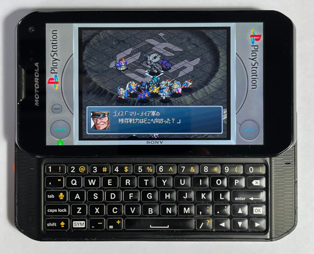
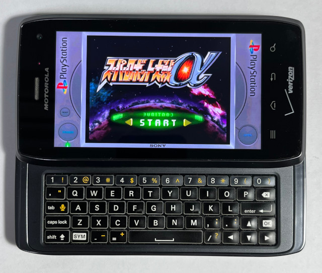
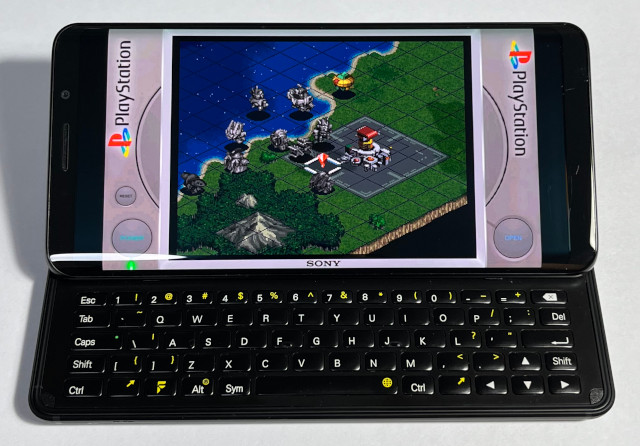

# SDL v1.2 Ported for SailfishOS  
This repository contains the SDL v1.2 source code, ported for the following handheld devices:  
- Motorola Photon Q (XT897)  
  Utilizes Wayland Client for rendering and is only supported on Sailfish OS v4.4.0.68.
- Motorola Droid 4 (XT894)  
  Utilizes Wayland Client for rendering and is only supported on Sailfish OS v4.6.0.15.
- F(x)tec Pro1 (QX1000)  
  Utilizes Wayland Client for rendering and is only supported on Sailfish OS v4.4.0.72.

All dependent libraries are stored in the "dependency" folder and need be built manually after building the SDL library.
```
smpeg-0.4.5.tar.gz
libmikmod-3.1.21.tar.gz
sdl-1.2-gfx-2.0.25.tar.gz
sdl-1.2-ttf-2.0.11.tar.gz
sdl-1.2-sound-1.0.3.tar.gz
sdl-1.2-image-1.2.12.tar.gz
sdl-1.2-mixer-1.2.12.tar.gz
```

## Motorola Photon Q (XT897)
```
$ cd
$ git clone https://github.com/steward-fu/sdl
$ cd sdl
$ ./autogen.sh
$ ./configure --enable-video-sfos --enable-video-sfos-xt897 --build=arm-linux
$ make -j4
$ sudo make install
```
  

## Motorola Droid 4 (XT894)
```
$ cd
$ git clone https://github.com/steward-fu/sdl
$ cd sdl
$ ./autogen.sh
$ ./configure --enable-video-sfos --enable-video-sfos-xt894 --build=arm-linux
$ make -j4
$ sudo make install
```
  

## F(x)tec Pro1 (QX1000)
```
$ cd
$ git clone https://github.com/steward-fu/sdl
$ cd sdl
$ ./autogen.sh
$ ./configure --enable-video-sfos --enable-video-sfos-qx1000 --build=arm-linux
$ make -j4
$ sudo make install
```

