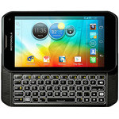
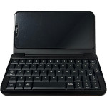

# Introduction
     

&nbsp;

This repository contains the SDL v1.2 source code, ported for the following handheld devices:  
- Motorola Photon Q (XT897)  
  Utilizes Wayland Client for rendering and is only supported on Sailfish OS v4.4.0.68.
- Motorola Droid 4 (XT894)  
  Utilizes Wayland Client for rendering and is only supported on Sailfish OS v4.6.0.15.
- F(x)tec Pro1 (QX1000)  
  Utilizes Wayland Client for rendering and is only supported on Sailfish OS v4.4.0.72.
- PINE64 PinePhone  
  Utilizes Wayland Client for rendering and is only supported on Sailfish OS v4.6.0.15.
- Miyoo A30  
  Uses OpenGL ES 2.0 for rendering. If the installed custom firmware (CFW) does not support OpenGL ES 2.0, this SDL v1.2 build will not work on the device.

&nbsp;

All dependent libraries are stored in the "dependency" folder and need be built manually after building the SDL library.
```
smpeg-0.4.5.tar.gz
libmikmod-3.1.21.tar.gz
sdl-1.2-gfx-2.0.25.tar.gz
sdl-1.2-ttf-2.0.11.tar.gz
sdl-1.2-sound-1.0.3.tar.gz
sdl-1.2-image-1.2.12.tar.gz
sdl-1.2-mixer-1.2.12.tar.gz
```

&nbsp;

# How to Build the Source Code
## Motorola Photon Q (XT897)
```
$ cd
$ git clone https://github.com/steward-fu/sdl
$ cd sdl
$ ./autogen.sh
$ ./configure --enable-video-xt897 --disable-video-x11 --build=arm-linux
$ make -j4
$ sudo make install
```

&nbsp;

## Motorola Droid 4 (XT894)
```
$ cd
$ git clone https://github.com/steward-fu/sdl
$ cd sdl
$ ./autogen.sh
$ ./configure --enable-video-xt894 --disable-video-x11 --build=arm-linux
$ make -j4
$ sudo make install
```

&nbsp;

## F(x)tec Pro1 (QX1000)
```
$ cd
$ git clone https://github.com/steward-fu/sdl
$ cd sdl
$ ./autogen.sh
$ ./configure --enable-video-qx1000 --disable-video-x11 --build=arm-linux
$ make -j4
$ sudo make install
```

&nbsp;

## PINE64 PinePhone
```
$ cd
$ git clone https://github.com/steward-fu/sdl
$ cd sdl
$ ./autogen.sh
$ ./configure --enable-video-pinephone --disable-video-x11 --build=arm-linux
$ make -j4
$ sudo make install
```

&nbsp;

## Miyoo A30
```
$ cd
$ wget https://github.com/steward-fu/website/releases/download/miyoo-a30/a30_toolchain-v1.0.tar.gz
$ tar xvf a30_toolchain-v1.0.tar.gz
$ sudo mv a30 /opt

$ export PATH=/opt/a30/bin:$PATH
$ export CC=arm-linux-gcc
$ export CXX=arm-linux-g++
$ export LD=arm-linux-ld
$ export AS=arm-linux-as

$ git clone https://github.com/steward-fu/sdl
$ cd sdl
$ ./autogen.sh
$ ./configure --enable-video-a30 --disable-video-x11 --build=arm-linux
$ make -j4

$ ls build/.libs/*.so*
    build/.libs/libSDL.so
    build/.libs/libSDL-1.2.so.0
    build/.libs/libSDL-1.2.so.0.11.4
```

&nbsp;

# How to Run the Program with SDL Library
## Miyoo A30
Place libSDL-1.2.so.0 and the executable file in the same folder.
```
# kill -STOP `pidof MainUI`
# LD_LIBRARY_PATH=. ./xxx
# kill -CONT `pidof MainUI`
```
